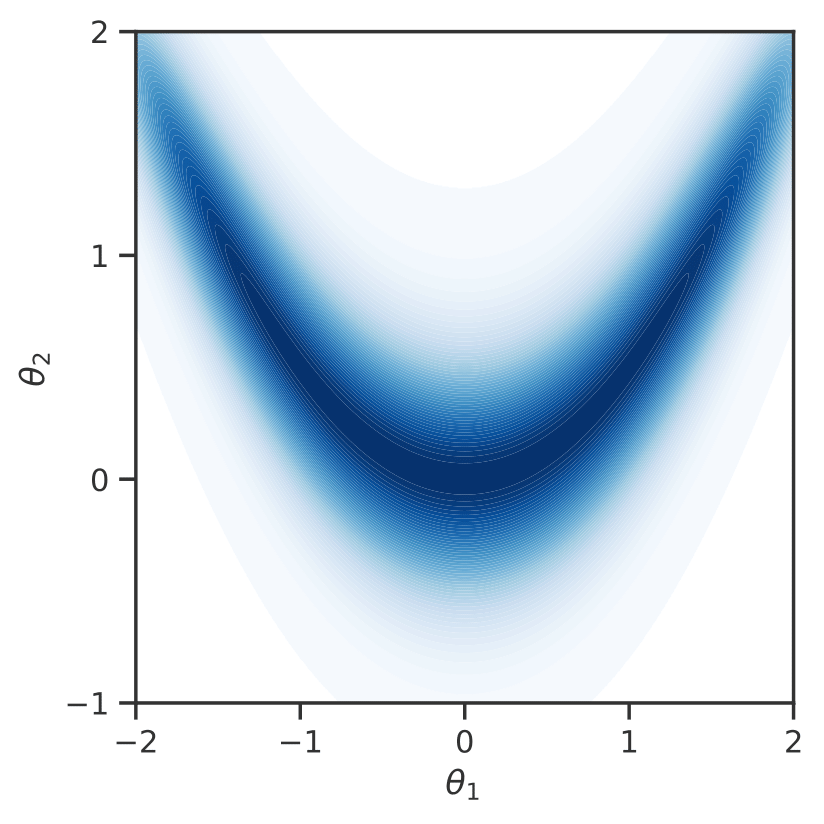
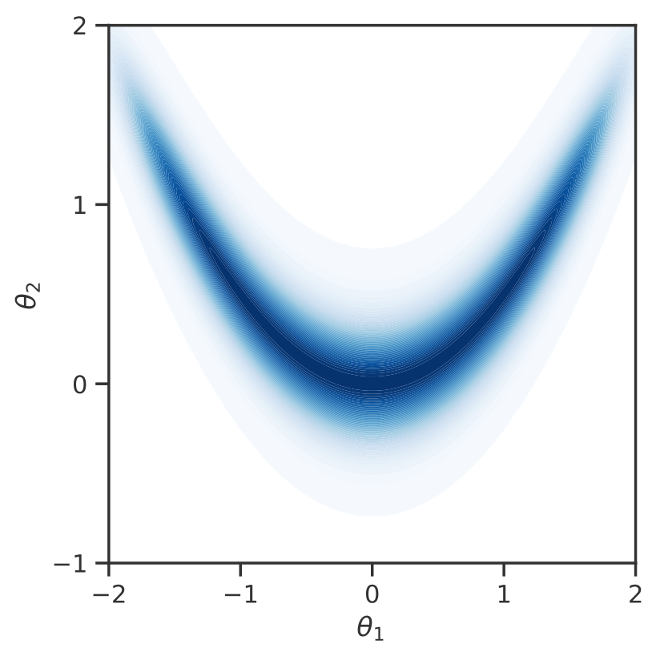
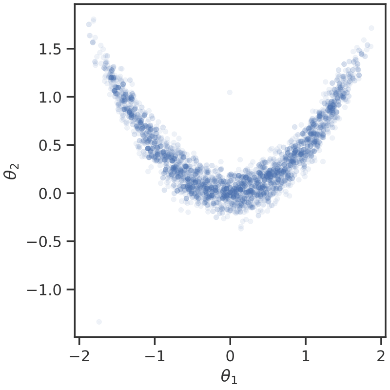
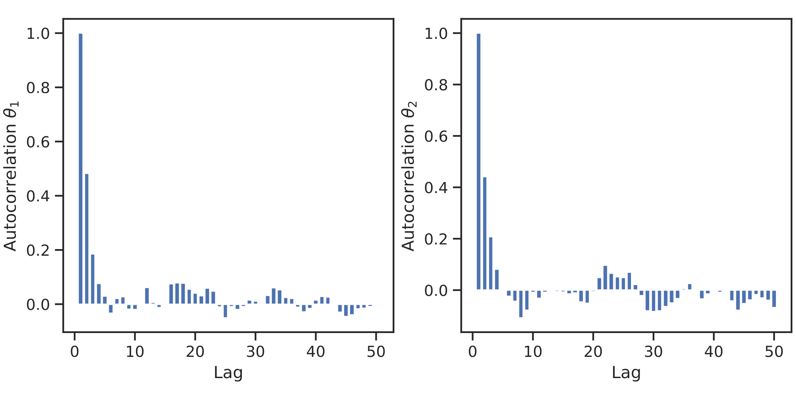
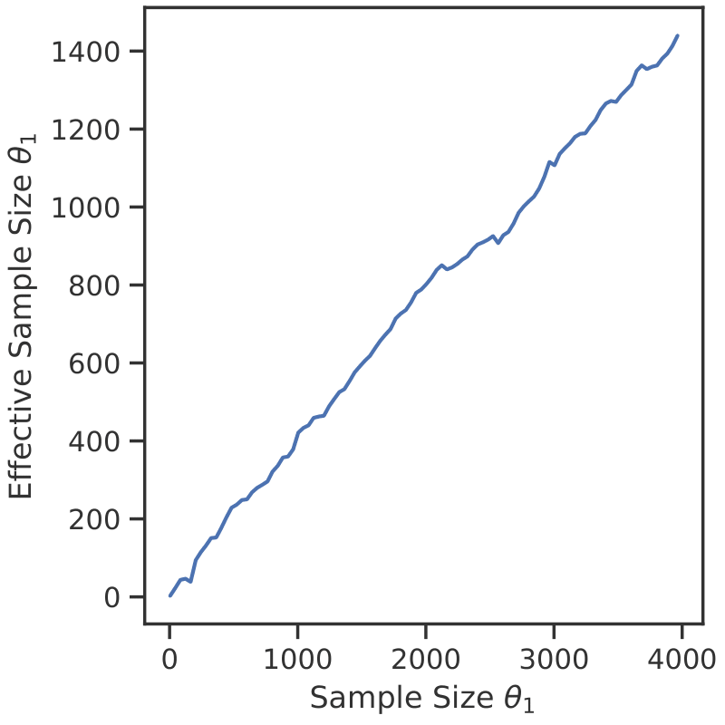
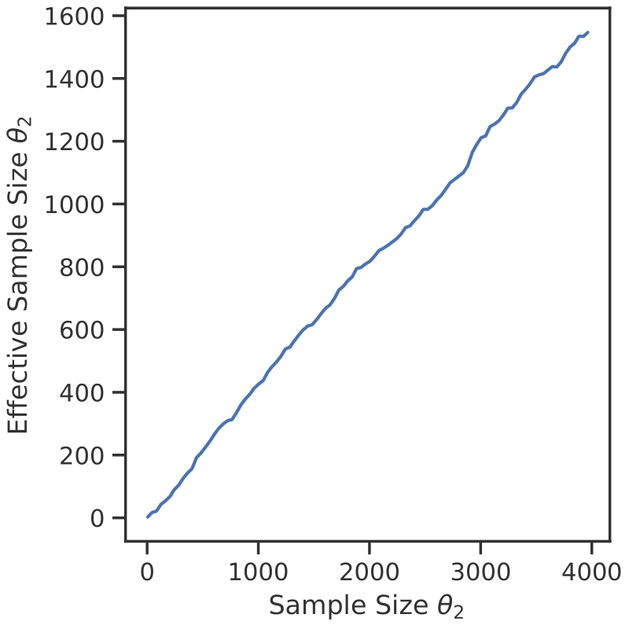

## Overview of MTMLDA

MTMLDA is a modular, low-level library, whose functionality is implemented in the `core` subpackage. Its main component is the [`MTMLDASampler`][mtmlda.core.sampling.MTMLDASampler] sampler object, which requires, next to MCMC-specific components, a list of callables resembling the model hierarchy (log densities). To accommodate different scenarios, we provide the user with the possibility to implement an object with the interface of [`ApplicationBuilder`][mtmlda.components.abstract_builder.ApplicationBuilder] in the `components` subpackage. In addition, the `components` module provides interfaces and exemplary implementations of components that are typically required to set up a hierarchy of Bayesian posterior densities.

The builder can then be used, in combination with a `settings.py` file, to set up a [`ParallelRunner`][mtmlda.run.runner.ParallelRunner] object in the `run` subpackage. This object assembles the model hierarchy and sampler. Subsequently, it can run multiple MLDA chains in parallel, each of which is potentially parallelized though prefetching. All parallelization is effectively handled through the asynchronous calls to the hierarchy of models. To process these request effectively, we rely on the [UM-Bridge](https://um-bridge-benchmarks.readthedocs.io/en/docs/) framework, which can dispatch the calls to any sort of external framework, up to HPC architectures. The results of an mtmlda run comprise detailed logfiles (run and debug), as well as the generated chains, and potentially the Markov trees generated during the sampling. Data and trees can be analyzed by the [`Postprocessor`][mtmlda.run.postprocessor.Postprocessor] in the `run` module. All mentioned components have extensive in-code documentation, which we refer the reader to for more detailed information on their usage and implementation.


## Quickstart

In the following, we focus on the execution of the example application [`example_03`](https://github.com/UQatKIT/mtmlda/tree/main/examples/example_03). The model-side in this example constitutes a hierarchy of 2D "banana" densities. Based on a precision coefficient $c_i$, we write for the parameters $\theta_1,\theta_2\in\mathbb{R}$ of the $i$-th member of the density hierarchy

$$
\begin{equation}
    \pi_i(\theta_1, \theta_2) \propto \exp \Big[ -\textstyle \frac{1}{2}c_i\big(20(\theta_1^2 - 2\theta_2)^2 + 2 (\theta_2 - \frac{1}{4})^4\big)^2 \Big].
\end{equation}
$$

We construct a hierarchy of models with precision parameters $c_i=\{0.1, 0.3, 1.0\}$, as shown below.

<figure markdown>
{ width="320" style="display: inline-block"}
{ width="320" style="display: inline-block"}
{ width="320" style="display: inline-block"}
</figure>

Any application to be processed by the standard workflow has to comprise a `settings.py`and a `builder.py` file. The settings file is the unified entry point for the configuration of the models, the builder and the sampler. It implements data classes that serve as input settings for the respective components. To execute the code, `cd` into the `examples` directory with mtmlda installed.

For the MCMC client to work, we need to start a server-side model hierarchy to be called. This is implemented as an UMBridge server in `simulation_model.py`, execute in a separate terminal session with
```
python example_03/simulation_model.py
```

To then execute a sampling application, simply invoke the `run.py` script with the application direction as argument,
```
python run.py -app example_03
```
The run script sets up a parallel runner for the execution and conducts the MLDA run. Its output comprises a number of log files, along with the produced MCMC chains in `npy` format. Optionally, the sampler produces Markov trees and RNG states can be saved as `dot` and `pkl` files, respectively.

Subsequently, you can analysize and visualize results with
```
python postprocessing.py -app example_03
```

This produces a number of plots, and optionally renders the generated Markov trees.

!!! warning
    Rendering trees is expensive, only perform this on a small number of dot files.

Firstly, we can inspect the resulting samples:
<figure markdown>
{ width="500" style="display: inline-block" }
</figure>

The MLDA sampler significantly reduces autocorrelation between samples, as can be seen here:
<figure markdown>
{ width="800" style="display: inline-block" } 
</figure>

This goes along with a drastically increased effective sample size:
<figure markdown>
{ width="400" style="display: inline-block"}
{ width="400" style="display: inline-block"}
</figure>

## Configuration

In this section, we discuss in more detail the actual settings specified in `settings.py`, for the example application `example_03`.

!!! info
    Several settings may be set and/or modified by the parallel run wrapper, depending on the index of the parallel chain they are used for.


<style>
table th:first-of-type {
    width: 300px;
}
table th:nth-of-type(2) {
    width: 700px;
}
</style>


### MTMLDA Algorithm configuration

The first block of settings is identical for all applications, it comprises the settings for the MTMLDA algorithm.

| **`ParallelRunSettings`** | Configures the parallel runner wrapper                                            |
| ------------------------- | --------------------------------------------------------------------------------- |
| `num_chains`              | Determines the number of parallel MLDA chains to sample                           |
| `chain_save_path`         | Indicates the directory where to store the resulting samples in `npy` file format |
| `chain_load_path`         | Can point to existing samples for re-initialization of a sampling run             |
| `rng_state_save_path`     | Can be set to store the numpy RNGs used during sampling in `pkl` format           |
| `rng_state_load_path`     | Can fetch those RNGs for re-initialization                                        |
| `overwrite_chains`        | Indicates whether overwriting existing chain data is permitted                    |
| `overwrite_rng_states`    | Indicates the same for the RNGs                                                   |


| **`SamplerSetupSettings`** | Configures the initialization of the MLDA sampler                                                                                                                                                |
| -------------------------- | ------------------------------------------------------------------------------------------------------------------------------------------------------------------------------------------------ |
| `num_levels`               | Indicates the depth of the multilevel model hierarchy                                                                                                                                            |
| `subsampling_rates`        | Determines the length of subchains on respective levels, from coarse to fine, has to be of length `num_levels`                                                                                   |
| `max_tree_height`          | Is a technical setting, restricting the Markov tree in the algorithm to a maximum depth. This depth should usually not be reached.                                                               |
| `underflow_threshold`      | Is the value for the obtained log densities below which the corresponding density is treated as zero. The threshold is implemented for numerical stability.                                      |
| `rng_seed_mltree`          | Is the seed of the RNG that is used for the uniform numbers for comparison in accept/reject steps. Every new node in  a Markov tree is equipped with such a random number.                       |
| `rng_seed_node_init`       | Is the seed of the RNG used for initialization of the first node in the Markov tree. The RNG samples an initial state, only necessary if such a state is not provided (see `SamplerRunSettings`) |
| `mltree_path`              | Indicates where to store exported Markov trees, if wanted                                                                                                                                        |

| **`SamplerRunSettings`** | configures the MLDA run for an initialized sampler                      |
| ------------------------ | ----------------------------------------------------------------------- |
| `num_samples`            | Denotes the number of fine-level samples to generate                    |
| `initial_state`          | Defines the initial parameter value in the chain                        |
| `num_threads`            | Is the number of parallel workers for prefetching                       |
| `print_interval`         | Determines the stride on samples after which info is sent to the logger |

| **`LoggerSettings`** | configures the MTMLDA logger                            |
| -------------------- | ------------------------------------------------------- |
| `do_printing`        | Determines if the run logger info is printed to console |
| `logfile_path`       | Indicates where run logger info is stored, if wanted    |
| `debugfile_path`     | Indicates where debug logger info is stored, if wanted  |

### Problem-Specific Setup

The second block of settings goes into the application builder, it is therefore application-specific.


| **`InverseProblemSettings`** | configures the initialization of the model hierarchy for MLDA                                                     |
| ---------------------------- | ----------------------------------------------------------------------------------------------------------------- |
| `ub_model_configs`           | Defines the values of the `config` argument of calls to the UMBridge model server for each model in the hierarchy |
| `ub_model_address`           | Is the address of the UMBridge server                                                                             |
| `ub_model_name`              | Is the name of the UMBridge server                                                                                |

| **`SamplerComponentSettings`**  | Defines the configuration of the components to be passed to the MLDA sampler, the proposal and the accept rate estimator. In this example, we utilize a Metropolis [`RandomWalkProposal`][mtmlda.core.mcmc.RandomWalkProposal] and a [`StaticAcceptRateEstimator`][mtmlda.core.mcmc.StaticAcceptRateEstimator] |
| ------------------------------- | -------------------------------------------------------------------------------------------------------------------------------------------------------------------------------------------------------------------------------------------------------------------------------------------------------------- |
| `proposal_step_width`           | Is the step width of the random walk proposal                                                                                                                                                                                                                                                                  |
| `proposal_covariance`           | Is the covariance matrix for the Gaussian proposal step                                                                                                                                                                                                                                                        |
| `proposal_rng_seed`             | Is the seed initializing the RNG for proposal step sampling                                                                                                                                                                                                                                                    |
| `accept_rates_initial_guess`    | Sets the initial accept rate estimates for each level in the model hierarchy, from coarse to fine                                                                                                                                                                                                              |
| `accept_rates_update_parameter` | Is a factor for the decrease/increase of the accept rate estimate of a level if a proposal is accepted or rejected through an MCMC decision                                                                                                                                                                    |
  
|**`InitialStateSettings`** | Determines how to initialize the Markov Chain for MLDA. For our application, initial samples are drawn from a Gaussian distribution with prescribed attributes |
| --------------------------- | ----------------------------------------------------------------------- |
| rng_seed_init | Seed for the RNG generator underlying the sampler |
| mean_init | Mean of the Gaussian distribution to sample from |
| covariance_init | Covariance of the Gaussian distribution to sample from |

### Postprocessor

The last block of settings is again generic, it comprises the configuration of the postprocessor.

| **`PostprocessorSettings`** | Configure postprocessing                                                |
| --------------------------- | ----------------------------------------------------------------------- |
| `chain_directory`           | points to the sampled chains to postprocess                             |
| `tree_directory`            | points to exported Markov trees for rendering, if wanted                |
| `output_data_directory`     | says where to store postprcessed data                                   |
| `visualization_directory`   | says where to store visualizations                                      |
| `acf_lag_max`               | determines up to which lag autocorrelation functions should be computed |
